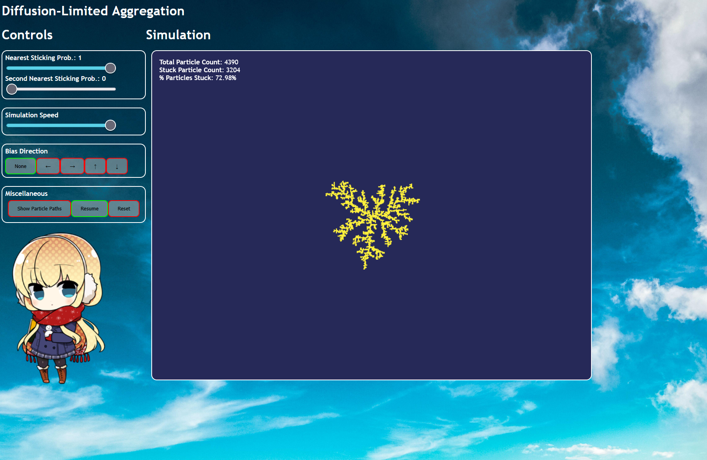

# Modelling Diffusion-Limited Aggregation
Modelling a DLA cluster, whereby randomly moving particles stick together to form a fractal cluster, taking inspiration from Witten & Sander's 1983 model. It also looks like a snowflake which is awesome!!!

<p align="center">
  
</p>  

<p align="center">
  
</p>

This gif is from the Python simulation (in py folder) I made for a class in university. I wanted to make an interactive version, where you could control the parameters, so I remade the project from scratch in JavaScript and HTML. I couldn't replicate the colormap in JavaScript so I just went with a navy-yellow colour scheme. You can play around with it here: [Interactive Simulation](https://h0sh1z0ra.github.io/DLA/)


 
## Theory
Basically, particles are spawned and will walk randomly until they stick to the cluster or wander too far away and die. They walk via Monte Carlo. Particles that walk have a higher chance of sticking to an outer branch, since the outer branches shields the inner areas.

Also, if you're curious and/or skeptical, you can verify that the clusters formed are actual clusters by running the test_dla.py using pytest:
```bash
cd py
pip install numpy matplotlib pytest
python dla.py
pytest -v
```
It takes a little while, since the Python script generates the whole cluster at once. Verifies that there are exactly the particles specified in the code, no floating particles and fractal dimension (true clusters are scale-invariant, so here, dimension is ratio of change in detail to change in scale). Also, since the simulation is stochastic (random process), this verifies seeded reproducibility to show that using the same seeds produces the same clusters, despite it being "random" (like a Minecraft seed!!!).

## Usage
You can change the probability of a particle sticking to the nearest-neighbour (like the sides of a square) of a cluster particle and second-nearest-neighbour (vertices of a square). You can also change the speed of the simulation, bias the direction of growth, trace the path a particle walks and some other stuff.

If you do decide to trace the paths, run the simulation at a slower speed to see the particles actually walking!

## Known Issues
When a particle walks over the cluster (which wouldn't happen in real life), it erases that point on the cluster.

## Image Sources
Icon and Chibi on page: Bethly from Gin'iro Haruka<br>
Haru Urara above: by [mochimochi_kinako on danbooru](https://danbooru.donmai.us/posts/8566433)
